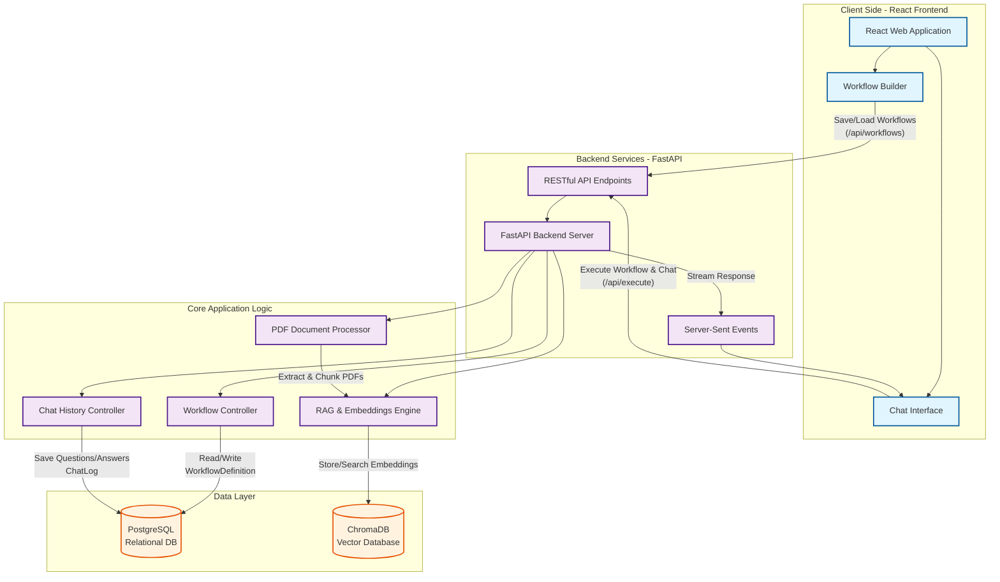

# High-Level Design (HLD)

The following is the Mermaid code for the system architecture based on the full-stack setup (React, FastAPI, PostgreSQL, ChromaDB).

```mermaid
graph TD
    subgraph Client [Client Side - React Frontend]
        UI[React Web Application]
        WF[Workflow Builder]
        ChatUI[Chat Interface]
        
        UI --> WF
        UI --> ChatUI
    end

    subgraph API [Backend Services - FastAPI]
        Server[FastAPI Backend Server]
        REST[RESTful API Endpoints]
        SSE[Server-Sent Events]
    end

    subgraph CoreProcessors [Core Application Logic]
        WkflManager[Workflow Controller]
        ChatManager[Chat History Controller]
        DocProcessor[PDF Document Processor]
        RAGEngine[RAG & Embeddings Engine]
    end

    subgraph DataLayer [Data Layer]
        Postgres[(PostgreSQL <br> Relational DB)]
        Chroma[(ChromaDB <br> Vector Database)]
    end

    %% Client interactions with API
    WF -- "Save/Load Workflows <br> (/api/workflows)" --> REST
    ChatUI -- "Execute Workflow & Chat <br> (/api/execute)" --> REST
    REST --> Server
    Server -- Stream Response --> SSE
    SSE --> ChatUI

    %% API routing to Core Logic
    Server --> WkflManager
    Server --> ChatManager
    Server --> DocProcessor
    Server --> RAGEngine

    %% Core Logic to Data Storage
    WkflManager -- "Read/Write <br> WorkflowDefinition" --> Postgres
    ChatManager -- "Save Questions/Answers <br> ChatLog" --> Postgres
    
    DocProcessor -- Extract & Chunk PDFs --> RAGEngine
    RAGEngine -- Store/Search Embeddings --> Chroma

    %% Styling
    classDef frontend fill:#e1f5fe,stroke:#01579b,stroke-width:2px;
    classDef backend fill:#f3e5f5,stroke:#4a148c,stroke-width:2px;
    classDef database fill:#fff3e0,stroke:#e65100,stroke-width:2px;

    class UI,WF,ChatUI frontend;
    class Server,REST,SSE,WkflManager,ChatManager,DocProcessor,RAGEngine backend;
    class Postgres,Chroma database;
```
