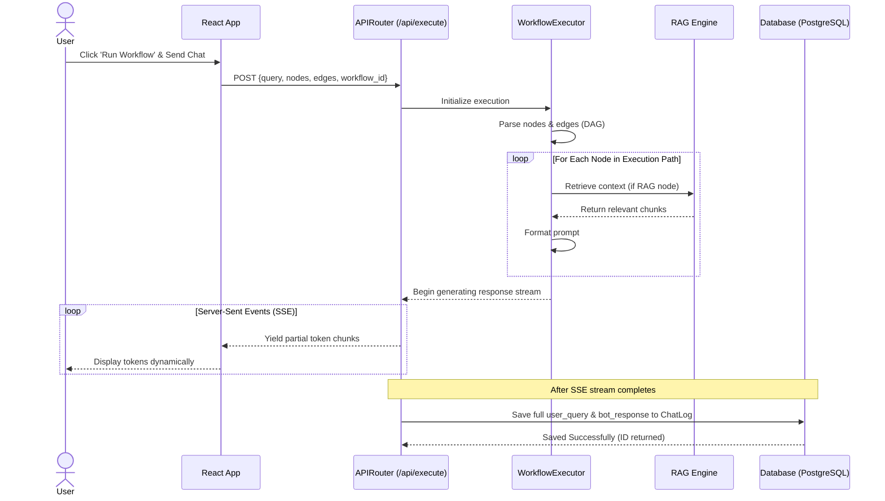

# Low-Level Design (LLD)

The following Mermaid diagrams provide a low-level architectural view of the system, including Backend Models, Frontend Components, API interactions, and a Sequence Diagram detailing the execution flow.

## 1. Class Diagram (Models, Components, and Services)

```mermaid
classDiagram
    %% Core Database Models
    class DocumentMetadata {
        +Integer id
        +String filename
        +DateTime upload_date
    }

    class WorkflowDefinition {
        +Integer id
        +String name
        +JSON graph_json
        +List~ChatLog~ chat_logs
    }

    class ChatLog {
        +Integer id
        +Integer workflow_id
        +String session_id
        +String user_query
        +String bot_response
        +DateTime created_at
        +WorkflowDefinition workflow
    }

    WorkflowDefinition "1" --> "0..n" ChatLog : has many

    %% Pydantic Request/Response Schemas
    class NodeSchema {
        +String id
        +String type
        +Dict data
    }
    
    class EdgeSchema {
        +String id
        +String source
        +String target
    }

    class ExecuteWorkflowRequest {
        +String query
        +List~NodeSchema~ nodes
        +List~EdgeSchema~ edges
        +Integer workflow_id
    }

    ExecuteWorkflowRequest *-- NodeSchema
    ExecuteWorkflowRequest *-- EdgeSchema

    %% React Frontend Structure
    class App {
        <<React Component>>
        +ReactFlowInstance reactFlow
        +Array nodes
        +Array edges
        +onNodesChange()
        +onEdgesChange()
        +onConnect()
    }

    class ChatInterface {
        <<React Component>>
        +Array messages
        +String input
        +handleSend()
        +renderMessages()
    }

    class WorkflowControls {
        <<React Component>>
        +saveWorkflow()
        +loadWorkflow()
        +clearCanvas()
    }

    App *-- ChatInterface
    App *-- WorkflowControls

    %% FastAPI Backend Services
    class APIRouter {
        <<FastAPI>>
        +POST /api/upload_pdf
        +POST /api/execute
        +POST /api/workflows
        +GET /api/workflows
        +GET /api/workflows/{id}
    }

    class DocumentProcessor {
        +extract_text(pdf)
        +chunk_text(text)
    }

    class RAGEngine {
        +embed_and_store(chunks)
        +query_similar_chunks(query)
    }

    class WorkflowExecutor {
        +parse_graph(nodes, edges)
        +execute_path()
        +generate_llm_stream()
    }

    APIRouter ..> DocumentProcessor : uses
    APIRouter ..> RAGEngine : uses
    APIRouter ..> WorkflowExecutor : uses
```

## 2. Sequence Diagram (Workflow Execution & Chat Persistence)


